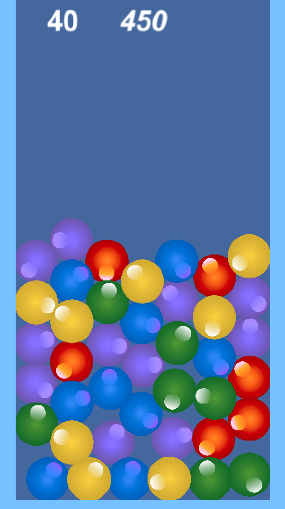

# Tsum Tsum

Author: Qinye Li  
Date: October, 2017 ~

## About

ディズニーゲーム[ツムツム](http://www.disney.co.jp/games/dtt.html)、可愛いですよね。キュートでシンプルなキャラクターデザインがなんとも絶妙。私も最近はもう完全にハマってます。

でも時々思います。自分で好きなキャラクターや、周りの友達の似顔絵をデザインしてゲームにして見たい。ディズニー以外のキャラクターでも遊んで見たい。でもLINEさんもDisneyさんもそんなわがままは聞いてくれない。じゃあ自分で作ろう。Unity の勉強にもなるしいいんじゃないか。

そんなわけで、Sindy の **ツムツム風パズルゲームを作って見た！** です。

## References

1. [ツムツム風パズルを作ろう (Unity入門) | OpenBook](https://openbook4.me/projects/161/sections/959)  
I used pictures from this tutorial : ) Very cute balls.
2. [ツムツム風パズルゲーム -- ひよこのたまご](http://hiyotama.hatenablog.com/entry/2015/05/18/090000)  
This one is very very detailed with screen captures explaining GameObject settings.
3. [(Youtube link) ツムツム風パズル連結方法改良](https://www.youtube.com/watch?v=abjUkhZwqvA)
4. Score calculation: [(Combo)](http://xn--tck7aa1hrab8k.xyz/%E3%83%84%E3%83%A0%E3%83%84%E3%83%A0-%E3%82%B3%E3%83%B3%E3%83%9C%E3%81%A8%E7%82%B9%E6%95%B0%E8%A8%88%E7%AE%97%E3%81%AE%E8%A7%A3%E8%AA%AC/) [(Chain)](https://www.google.com/search?q=%E3%83%84%E3%83%A0%E3%83%84%E3%83%A0+%E3%83%81%E3%82%A7%E3%83%BC%E3%83%B3%E3%80%80%E3%82%B9%E3%82%B3%E3%82%A2+3500&oq=%E3%83%84%E3%83%A0%E3%83%84%E3%83%A0+%E3%83%81%E3%82%A7%E3%83%BC%E3%83%B3%E3%80%80%E3%82%B9%E3%82%B3%E3%82%A2+3500&gs_l=psy-ab.3...357696.359574.0.359741.5.5.0.0.0.0.216.479.4j0j1.5.0....0...1.1.64.psy-ab..0.1.216...0i30k1.0.-Fo3_zq9qcA) [(Fever)](http://xn--bdkam3b3db8k4475bco4a.jp/1240.html)